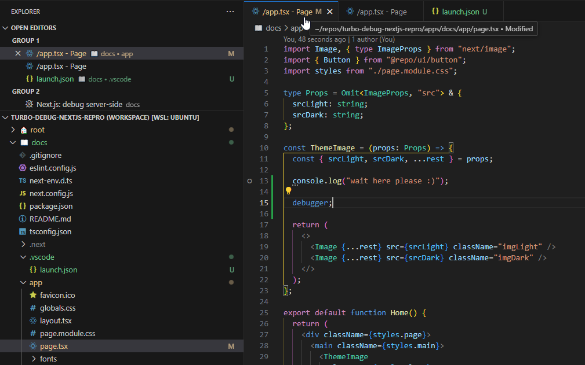
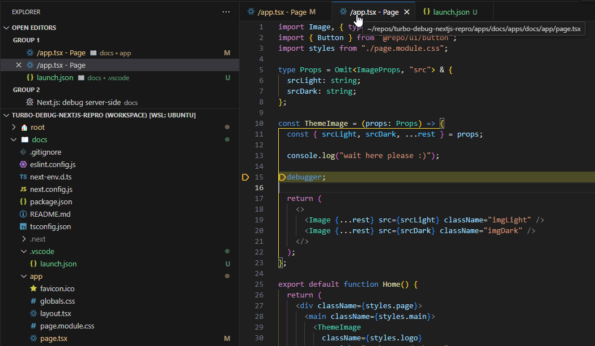

# Repoduction Repo - Turborepo x Next.js x VS Code
1. Using VS Code, open either 
   the file [turbo-debug-nextjs-repro.code-workspace](turbo-debug-nextjs-repro.code-workspace):
   ```
   code turbo-debug-nextjs-repro.code-workspace
   ```
   
   or the folder [docs](apps/docs/):
   ```
   code apps/docs
   ```
2. Open the file [`app/page.tsx`](apps/docs/app/page.tsx) inside the folder `apps/docs/`.
3. Set a breakpoint on the same line as the `console.log`.
4. Start the debugger by pressing `F5` or similar.
5. Observe 
   - the debugger NOT stopping at the breakpoint
   - the debugger stopping at the debugger statement
   - the debugger opening a second VS Code file tab
   - the paths of the two tabs not matching when hovering over the tab labels (see screenshot below)  

-> As can be seen: The debugger kind of adds the path to the workspace folder to the path of the file it is debugging - resulting in doubling the path segments.

```diff
- ~/repos/turbo-debug-nextjs-repro/apps/docs/app/page.tsx
+ ~/repos/turbo-debug-nextjs-repro/apps/docs/apps/docs/app/page.tsx
```


**Screenshot - Actual page.tsx file**

**Screenshot - The "file" the debugger is actually debugging**


-- 
# Turborepo starter

This is an official starter Turborepo.

## Using this example

Run the following command:

```sh
npx create-turbo@latest
```

## What's inside?

This Turborepo includes the following packages/apps:

### Apps and Packages

- `docs`: a [Next.js](https://nextjs.org/) app
- `web`: another [Next.js](https://nextjs.org/) app
- `@repo/ui`: a stub React component library shared by both `web` and `docs` applications
- `@repo/eslint-config`: `eslint` configurations (includes `eslint-config-next` and `eslint-config-prettier`)
- `@repo/typescript-config`: `tsconfig.json`s used throughout the monorepo

Each package/app is 100% [TypeScript](https://www.typescriptlang.org/).

### Utilities

This Turborepo has some additional tools already setup for you:

- [TypeScript](https://www.typescriptlang.org/) for static type checking
- [ESLint](https://eslint.org/) for code linting
- [Prettier](https://prettier.io) for code formatting

### Build

To build all apps and packages, run the following command:

```
cd my-turborepo
pnpm build
```

### Develop

To develop all apps and packages, run the following command:

```
cd my-turborepo
pnpm dev
```

### Remote Caching

Turborepo can use a technique known as [Remote Caching](https://turbo.build/repo/docs/core-concepts/remote-caching) to share cache artifacts across machines, enabling you to share build caches with your team and CI/CD pipelines.

By default, Turborepo will cache locally. To enable Remote Caching you will need an account with Vercel. If you don't have an account you can [create one](https://vercel.com/signup), then enter the following commands:

```
cd my-turborepo
npx turbo login
```

This will authenticate the Turborepo CLI with your [Vercel account](https://vercel.com/docs/concepts/personal-accounts/overview).

Next, you can link your Turborepo to your Remote Cache by running the following command from the root of your Turborepo:

```
npx turbo link
```

## Useful Links

Learn more about the power of Turborepo:

- [Tasks](https://turbo.build/repo/docs/core-concepts/monorepos/running-tasks)
- [Caching](https://turbo.build/repo/docs/core-concepts/caching)
- [Remote Caching](https://turbo.build/repo/docs/core-concepts/remote-caching)
- [Filtering](https://turbo.build/repo/docs/core-concepts/monorepos/filtering)
- [Configuration Options](https://turbo.build/repo/docs/reference/configuration)
- [CLI Usage](https://turbo.build/repo/docs/reference/command-line-reference)
